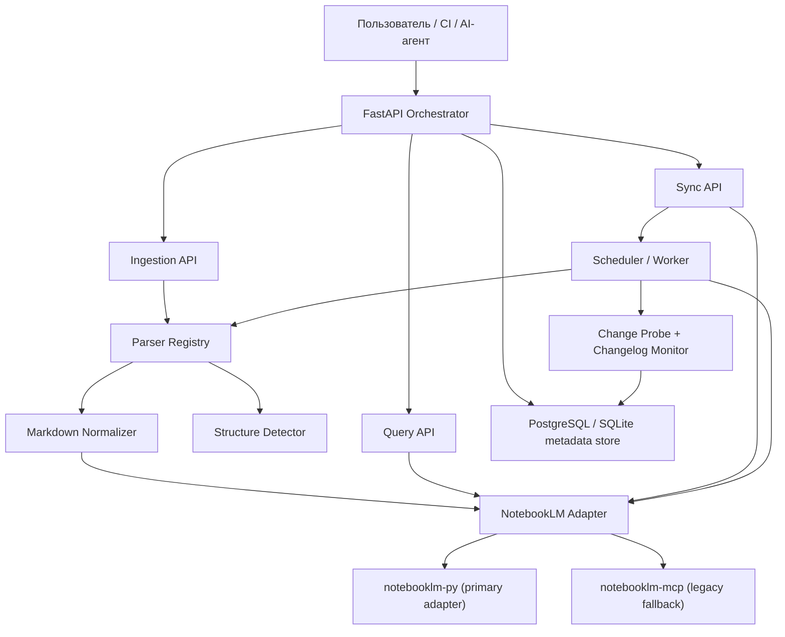

# Целевая архитектура и потоки продукта

## Главная идея

Продукт надо собирать не вокруг `MCP`-сервера и не вокруг отдельных парсеров, а вокруг трёх доменных контуров:

- ingestion документации;
- управление knowledge base и актуальностью;
- query orchestration для агентов и CI.

## Рекомендуемая архитектурная схема



## Архитектурный принцип

`NotebookLM` должен быть внешним execution backend, а не сердцем продукта.

Сердце продукта:

- наша модель документов;
- наша БД состояний;
- наш оркестратор задач;
- наш API-контракт для агентов.

## Почему так

- тогда можно поменять реализацию `NotebookLM`-адаптера без переписывания бизнес-логики;
- можно жить и с `notebooklm-py`, и с `MCP`, и даже позже с другим knowledge backend;
- ingestion, sync и querying становятся тестируемыми независимо.

## Контур 1. Ingestion документации

## Цель

На вход дать URL документации. На выходе получить:

- карточку источника в БД;
- карту структуры документации;
- нормализованный Markdown;
- блокнот в `NotebookLM`;
- связанные source records и статус готовности.

## Рекомендуемый пайплайн

1. `POST /api/v1/ingestions`
2. Определение типа docs-сайта.
3. Выбор parser strategy.
4. Сбор оглавления и списка страниц.
5. Парсинг страниц.
6. Нормализация Markdown.
7. Сбор артефактов:
   - `full.md`
   - `toc.json`
   - `pages/*.md`
   - `manifest.json`
8. Создание блокнота.
9. Загрузка источников.
10. Запись `notebook_id`, `source_ids`, хешей и статусов в БД.

## Что надо добавить в модель данных

Минимально нужны таблицы:

- `documents`
- `document_versions`
- `document_pages`
- `notebooks`
- `notebook_sources`
- `sync_jobs`
- `query_jobs`
- `query_results`

## Пример полей `documents`

- `id`
- `title`
- `source_url`
- `provider`
- `parser_strategy`
- `status`
- `latest_version_id`
- `current_notebook_id`
- `last_checked_at`
- `last_synced_at`
- `last_error`

## Пример полей `document_versions`

- `id`
- `document_id`
- `content_hash`
- `toc_hash`
- `changelog_hash`
- `version_label`
- `artifact_path`
- `created_at`

## Контур 2. Sync и freshness monitoring

## Цель

Система должна сама понимать, когда знания устарели, и обновлять их без ручной возни.

## Рекомендуемый механизм

- периодический probe по `source_url`;
- если сайт отдаёт `ETag` или `Last-Modified`, использовать их;
- если есть changelog или releases page, выделять её как отдельный источник контроля;
- дополнительно хранить хеш нормализованного контента и дерева оглавления;
- если источник изменился, создавать `sync_job`.

## Состояния sync-job

- `queued`
- `running`
- `waiting_manual_auth`
- `retry_scheduled`
- `completed`
- `failed`

## Как использовать возможности `notebooklm-py`

Для URL/Drive-источников в `NotebookLM` полезны команды:

- `source stale`
- `source refresh`
- `metadata`

Это позволяет строить логику:

- сначала проверить, не устарел ли источник внутри самого `NotebookLM`;
- если устарел, попытаться обновить его штатно;
- если штатное обновление не решает задачу, перепарсить и перезагрузить через наш ingestion-пайплайн.

## Контур 3. Query orchestration

## Цель

AI-агент или CI-агент не должен знать про конкретные `NotebookLM`-внутренности.

Ему нужен стабильный API:

- принять вопрос;
- выбрать один или несколько релевантных блокнотов;
- отправить запросы;
- дождаться ответов;
- вернуть нормализованный JSON.

## Рекомендуемые эндпоинты

- `POST /api/v1/query`
- `POST /api/v1/query/batch`
- `POST /api/v1/query/route`
- `GET /api/v1/documents`
- `GET /api/v1/documents/{id}`
- `POST /api/v1/documents/{id}/refresh`
- `GET /api/v1/health/notebooklm`
- `POST /api/v1/notebooklm/re-auth`

## Контракт ответа `query/batch`

```json
{
  "request_id": "uuid",
  "question": "Как устроен роутинг в Next.js?",
  "targets": [
    {
      "document_id": "doc_nextjs",
      "notebook_id": "nb_123",
      "status": "completed",
      "answer": "Краткий ответ...",
      "sources": [
        {
          "title": "Routing",
          "url": "https://example.com/routing"
        }
      ],
      "latency_ms": 4820
    }
  ],
  "merged_answer": "Сводный ответ по всем релевантным источникам",
  "status": "completed"
}
```

## Роутинг по блокнотам

Сначала делай deterministic routing, а не LLM-only routing.

Пример правил:

- по `provider`;
- по `category`;
- по `topics`;
- по тегам документов;
- по ключевым словам вопроса;
- по last-success rate.

LLM-роутер можно добавить позже только как вспомогательный слой.

## Контур 4. Аутентификация `NotebookLM`

## Базовый принцип

Аутентификация должна быть отдельной подсистемой, а не побочным эффектом при первом запросе.

## Что рекомендую

- держать `NotebookLM`-adapter как отдельный Python-сервис/модуль;
- добавить `auth health` и `auth refresh` как first-class операции;
- проверять auth-state до выполнения ingestion/query job;
- если нужна ручная авторизация, переводить задачу в `waiting_manual_auth`, а не падать без контекста.

## Почему `notebooklm-py` здесь выглядит сильнее

- Python-first стек без лишнего межъязыкового слоя;
- есть команды для проверки auth и работы с источниками;
- модель CLI хорошо ложится в worker-обвязку;
- поведение с `ENTER` после логина явно задокументировано и совпадает с реальностью.

## Почему `MCP` всё ещё полезен

- в текущем форке уже есть много наработок по сессиям, библиотеке блокнотов и браузерной автоматизации;
- можно оставить его как временный fallback для тех операций, которых пока не хватает в `notebooklm-py`.

## Рекомендуемая стратегия адаптеров

- `NotebookLMAdapter` как интерфейс;
- `NotebookLMPyAdapter` как основной;
- `NotebookLMMcpAdapter` как fallback/legacy;
- выбор адаптера через конфиг и capability flags.

## Контур 5. CI и агентные сценарии

## Что должно работать из CI

- ночной probe изменений документации;
- построение списка stale docs;
- запуск refresh jobs;
- health-check `NotebookLM`;
- smoke-query по контрольным блокнотам;
- генерация отчёта о свежести базы знаний.

## Что лучше не пытаться делать в обычном hosted CI

- регулярную ручную браузерную авторизацию;
- сложный интерактивный логин в `NotebookLM`;
- долгие браузерные сессии без сохранённого auth-state.

## Практичный вариант

- probe, diff и orchestration можно гонять в обычном CI;
- операции, которым нужен живой браузерный auth-state, лучше выносить на self-hosted runner или отдельную машину-воркер;
- CI должен ставить задачу и читать её статус, а не напрямую всегда работать браузером.

## Рекомендации по стеку

Оставить:

- `FastAPI`
- `SQLAlchemy`
- `Alembic`
- текущие наработки `docs_parsing`

Добавить/перестроить:

- `NotebookLMAdapter` поверх `notebooklm-py`
- очередь задач или хотя бы worker-слой
- явные артефакты `manifest/toc/pages/full.md`
- отдельные sync/query job tables
- health endpoints и отчётность

Считать временным:

- прямую жёсткую привязку к vendored `notebooklm-mcp` как к единственному прод-движку.
